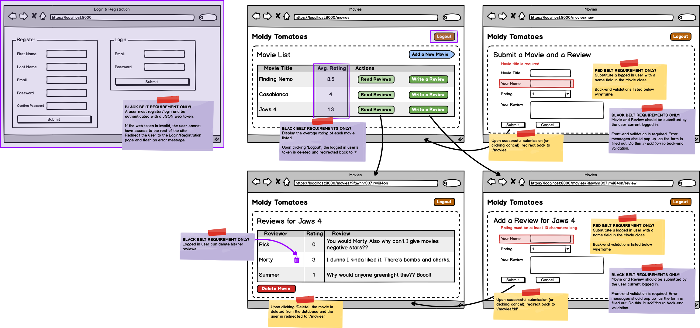

# Examen MERN

Desafío: Crear una aplicación de críticas de peliculas donde los usuarios puedan agregar películas y dejar reseñas en ella

## Para lograr el cinturón rojo

- Panel de control: muestra todas las películas
- Los usuarios pueden crear nuevas películas y reseñas
- Los usuarios pueden revisar las películas que se han creado
- Los usuarios pueden eliminar películas
- **Validaciones**
	- Todos los campos son obligatorios
  - Mostrar mensajes de error de backend

## Para lograr el cinturón negro

- Implementado/Desplegado en Amazon EC2 
Y 2 de las siguientes: 
  - Inicio de sesión y registro: el usuario debe iniciar sesión o registrarse para usar el resto de la aplicación
  - Panel de control: muestra la calificación promedio de cada película
  - Utiliza validaciones de front-end además de las validaciones de back-end
  - Permitir que un usuario elimine la reseña que dejó para una película

